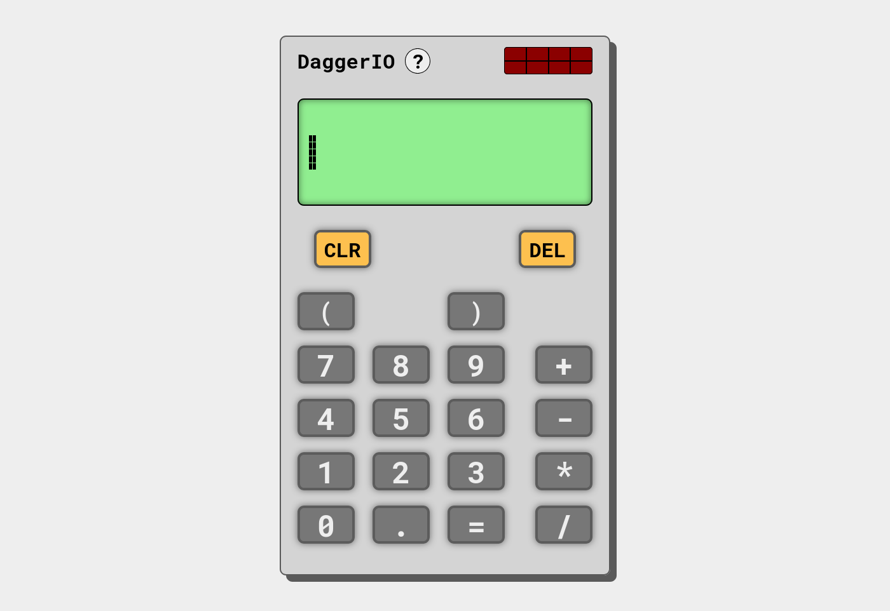
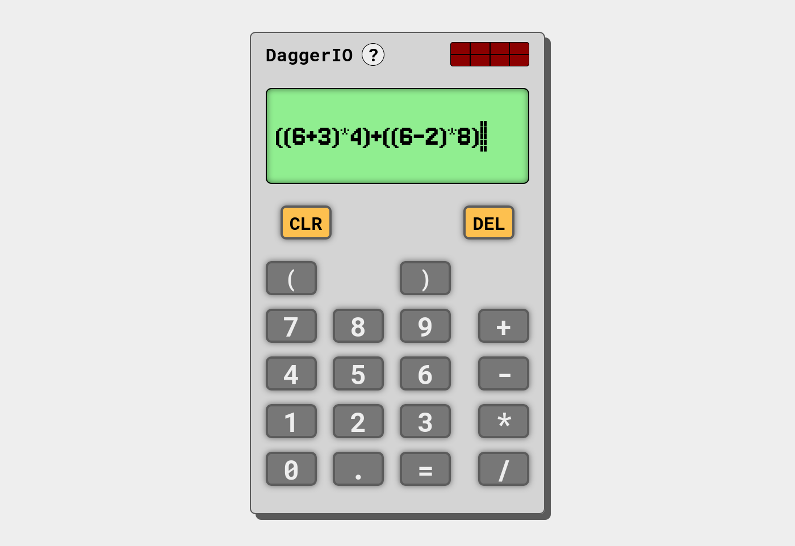
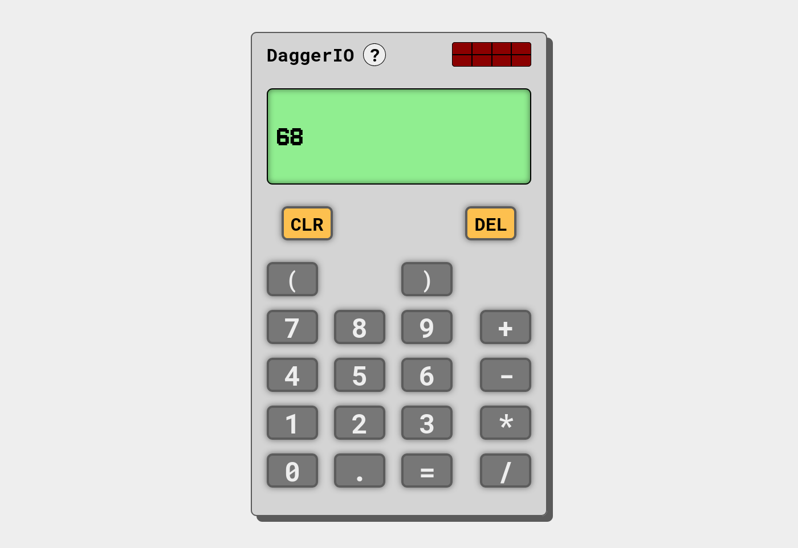

# Calculator

This is a simple calculator web app built using HTML, CSS, and JavaScript. It is the final project of the foundation course on [The Odin Project](https://www.theodinproject.com/).

You can view the app [here](https://stilettodagger.github.io/calculator/)

## Features

+ Allows the user to evaluate expressions with the following operations:
  + **Addition** `2 + 2`
  + **Subtraction** `5 - 2`
  + **Multiplication** `3 * 2`
  + **Division** `10 / 2`
+ Compound expressions are supported and the calculator follows the standard order of operations.`3 + 5 * 2 // 13`
+ Expressions with one or multiple sets of brackets are also supported. `(2 + 7) * 2`
+ **Two modes of input**:
  + **GUI input:** Accepts input by clicking on the GUI button elements.
  + **Keyboard input:** Accepts input from the user's keyboard. (*Only accepts numbers and certain characters*)
+ A graphical user interface (GUI) that is both appealing and easy to understand.
+ Responsive design that works on most screen sizes.

> [!NOTE]
> The app avoids using the `eval()` function to evaluate the user input expression. This is for [safety and security reasons](https://developer.mozilla.org/en-US/docs/Web/JavaScript/Reference/Global_Objects/eval#never_use_direct_eval!). Instead, the app has its own function that parses the user input and evaluate the expression properly. Additionally, the app restricts user input so that only supported characters such as numbers and operators are supported.

### Keyboard Shortcuts

The app supports the following keybindings:

+ `0` - `9`, `(`, `)`: Enters a number digit between 0 and 9 or an opening or closing bracket, and add it to the expression on the screen.
+ `+`, `-`, `*`, `/`: Enters an operation and add it to the expression on the screen.
+ `Enter`: Evaluates the expression and display the resulting expression on the screen.
+ `Backspace`: Deletes the last character from the expression.
+ `Esc`: Clears the entire expression on the screen and resets the calculator.

## Screenshots

## Credits and Attributions

Thanks once again to [The Odin Project](https://www.theodinproject.com/) for this project idea and for giving me the opportunity to learn.

The fonts used in this app were obtained from Google Fonts and include the following:

+ [Jersey 10](https://fonts.google.com/specimen/Jersey+10) - *by Sarah Cadigan-Fried*
+ [Roboto Mono](https://fonts.google.com/specimen/Roboto+Mono) - *by Christian Robertson*
